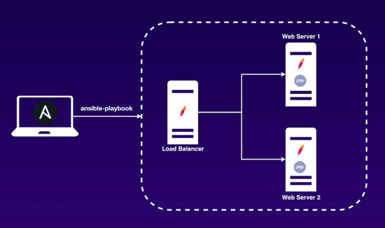

### Infrastructure

### Steps

1. Create the Key Pair on AWS EC2.
2. Download the Key Pair and save it under ~/.ssh/ folder.
3. Upload the setup-env.yml(./cloudformation/setup-env.yml) to AWS CloudFormation. The region should be in N.Virginia.
4. Retrieve the IP addresses of EC2 instances and LoadBalancer from AWS CloudFormation
5. Set up the IP addresses in hosts-dev file(./hosts-dev)
6. Run `ansible-playbook ./playbook/*.yml` to try different functionality

### Contents

1. groups
2. hosts
3. inventory
4. tasks
5. ping
6. setup
7. shell
8. yum
9. service
10. template
11. handlers
12. copy
13. debug
14. command
15. register
16. lineinfile
17. vars
18. prompt
19. roles
20. ansible-galaxy
21. ansible-vault
22. ignore_errors
23. warn
24. import_playbook